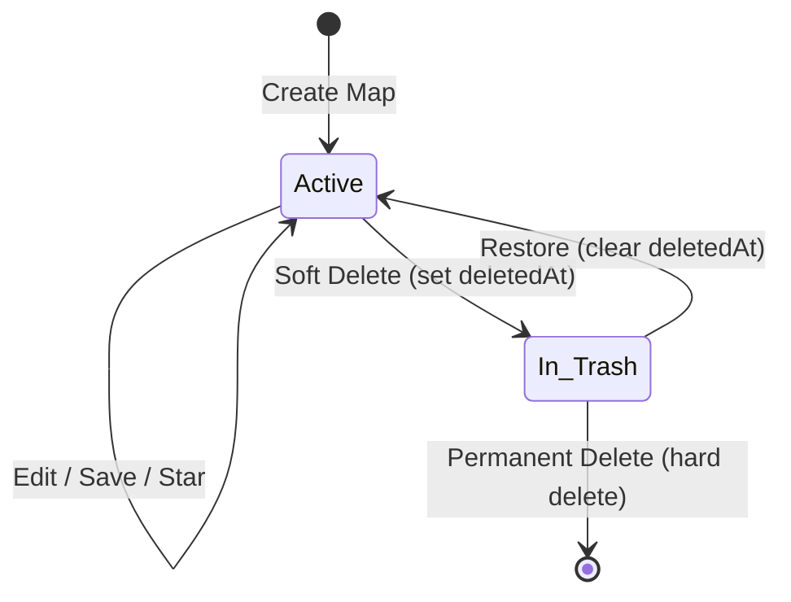
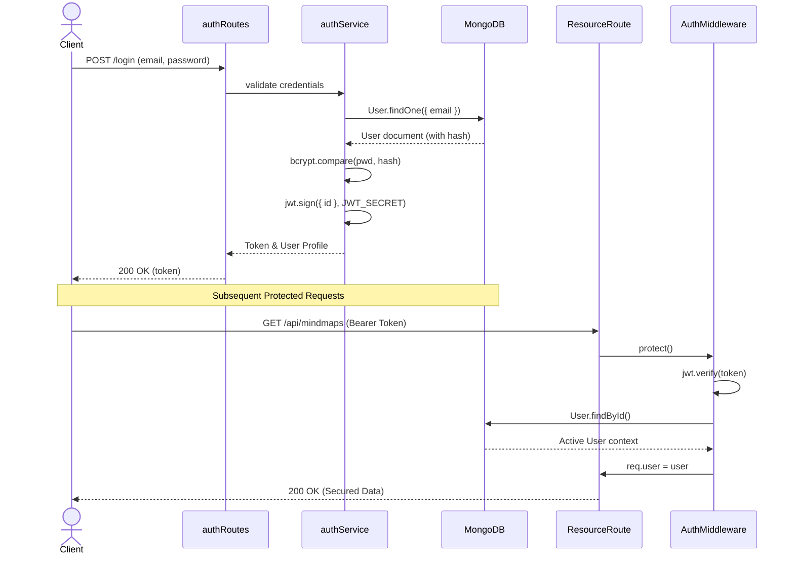
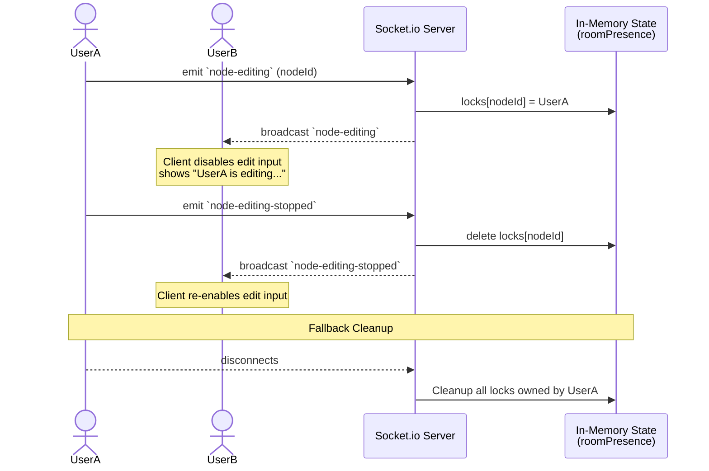
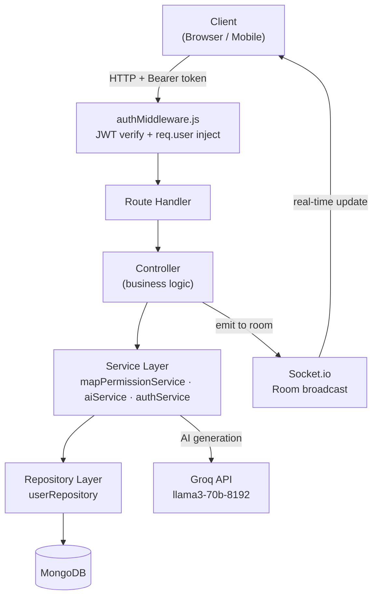
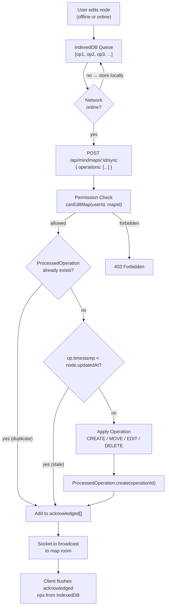
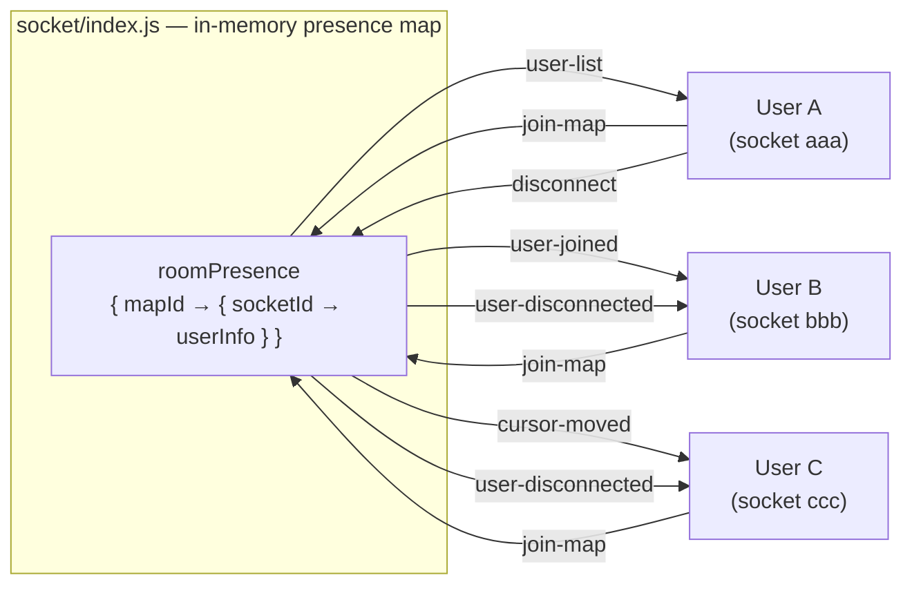
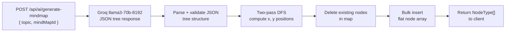
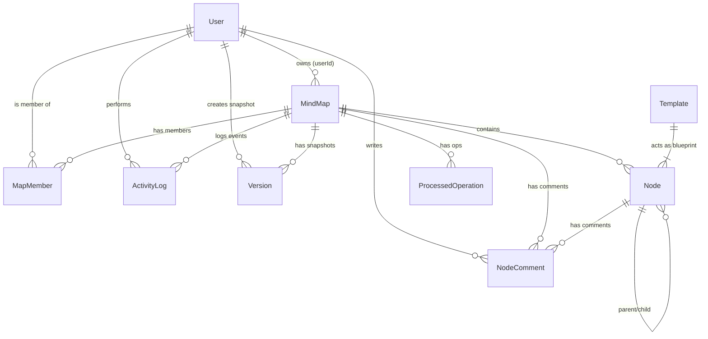

# 🧠 MindMap Pro — Backend Server

[](https://nodejs.org/)
[](https://expressjs.com/)
[](https://mongoosejs.com/)
[](https://socket.io/)
[](https://groq.com/)
[](https://opensource.org/licenses/MIT)
[](http://makeapullrequest.com)

> **Real-time collaborative mind mapping backend** — built with Node.js, Socket.io, and MongoDB.  
> Features an **offline-first sync engine** (idempotent operation queuing + LWW conflict resolution), **AI-powered map generation** via Groq Llama 3, and a clean **Controller → Service → Repository architecture** designed for scale.

---

## 🧭 Repository Navigation

| Resource | Link |
|---|---|
| 🖥️ **Frontend Client** | [mindmap-client](https://github.com/your-username/mindmap-client) |
| 🔧 **Backend Server** | [mindmap-server](https://github.com/your-username/mindmap-server) *(you are here)* |
| 📖 **API Reference** | [Jump to API Docs](#-api-reference) |
| 🏗️ **Architecture** | [Jump to Architecture](#️-architecture) |
| 🚦 **Setup Guide** | [Jump to Getting Started](#-getting-started) |

---

## 🎯 Live Demo

> **Note:** Add your deployed URLs here once the project is live.

| | Link |
|---|---|
| 🌐 **Live App** | `https://your-app.vercel.app` |
| 🔧 **API Base URL** | `https://your-api.railway.app/api` |
| 📹 **Video Walkthrough** | `https://drive.google.com/file/d/1jQwu18Q5VngjqHny4PnKimyoQaZbOAIf/view?usp=sharing` |

<!-- 
  📸 SCREENSHOTS
  Replace the placeholders below with actual screenshots or GIFs.
  Suggested shots:
    - Infinite canvas with several nodes
    - Two users collaborating (split screen)
    - AI generation in progress
    - Comments panel on a node
    - Focus/Zen mode
    - Version history panel
-->

---

## 💡 Project Motivation

Tools like **Miro**, **Whimsical**, and **XMind** are powerful but expensive, closed-source, and often too heavy for quick thought-capture. I wanted to build something that:

- Works **offline** — your ideas don't disappear when the internet drops.
- Lets multiple people **edit in real time** without data corruption.
- Uses **AI** not as a gimmick but as a genuine productivity boost: one-prompt → full mind map.
- Is **fully open-source** and architected with the same patterns used in production SaaS systems.

The result is a collaborative canvas that feels as fast locally as it does online, with the engineering depth to back it up.

---

## 📖 Table of Contents

- [🎯 Live Demo](#-live-demo)
- [💡 Project Motivation](#-project-motivation)
- [✨ Features](#-features)
- [🚀 Engineering Challenges](#-engineering-challenges)
- [⚡ Performance](#-performance)
- [🏗️ Architecture](#️-architecture)
- [🧩 System Design Principles](#-system-design-principles)
- [📂 Project Structure](#-project-structure)
- [🗄️ Data Models](#️-data-models)
- [🔌 API Reference](#-api-reference)
- [📡 WebSocket Events](#-websocket-events)
- [🧰 Tech Stack](#-tech-stack)
- [📣 Resume Highlights](#-resume-highlights)
- [🗺️ Roadmap](#️-roadmap)
- [📈 Scalability Considerations](#-scalability-considerations)
- [🚦 Getting Started](#-getting-started)
- [🤝 Contributing](#-contributing)
- [📜 License](#-license)

---

## ✨ Features

### 📴 Offline Sync Engine
- **Operation queue endpoint**: `POST /api/mindmaps/:id/sync` accepts a batch of `Operation` objects from the client's IndexedDB queue.
- **Idempotent deduplication**: Each operation has a unique `operationId`. The `ProcessedOperation` collection ensures the same op is never applied twice — safe for retries.
- **Last Write Wins (LWW) conflict resolution**: If an incoming operation's `timestamp` is older than the node's `updatedAt`, the op is acknowledged but **not applied** — preventing stale offline edits from stomping newer server state.
- **Batch broadcast**: After applying all ops, the server emits the corresponding Socket.io events to the map room so live collaborators see the sync result instantly.

### 🤖 AI Mindmap Generation (Groq)
- **One-prompt generation**: POST a topic string → Groq `llama3-70b-8192` returns a structured JSON tree → server converts to flat nodes and saves.
- **Prompt engineering**: A strict system prompt forces valid JSON output with up to 3 depth levels, 4–6 top-level subtopics, and 2–4 children each.
- **Subtree-centered layout**: A two-pass DFS algorithm computes each node's `x` and `y` so the tree is visually centered — no client-side layout pass required.
- **Clean slate**: The map's existing nodes are deleted before inserting the AI-generated tree, giving a fresh start.

### 🌲 Hierarchical Node Management
- **Infinite nesting** via `parentId` references.
- **Cascading deletes**: Removing a node recursively removes all descendants.
- **Spatial positioning**: Each node stores `x` and `y` for freeform canvas rendering.
- **Rich properties**: `color`, `fontSize`, `text`, `notes` per node.
- **Auto root node**: A "Central Idea" root node is created automatically for every new map.

### 👥 Role-Based Access Control
- **Three tiers**: `OWNER`, `EDITOR`, `VIEWER` — enforced at the API layer via `mapPermissionService`.
- Owner-exclusive actions: rename, delete, restore, share, permanently remove, manage members.
- Email-based invitations with duplicate and self-invite guards.
- Unique compound index on `(mindMapId, userId)` ensures a user holds only one role per map.

### 🔴 Real-Time Collaboration (Socket.io)
- Room-based architecture scoped per `mapId`.
- Live node sync: `node-added`, `node-updated`, `node-deleted`, `node-dragged`.
- Presence: `user-list`, `user-joined`, `user-disconnected`.
- Live cursors: `cursor-moved` relays real-time cursor positions with user identity.
- Edit locking: `node-editing` / `node-editing-stopped` prevent write conflicts.
- Remote selection highlights: `selection-update` shows which nodes peers are focused on.
- Graceful disconnect: edit locks and cursor data are automatically cleaned up.

### 🕒 Version Control & Snapshots
- Full-node snapshots stored as `Version` documents.
- Action types: `manual`, `auto-layout`, `align`, `delete`, `restore`.
- One-click restore broadcasts `map-restored` to all live collaborators.

### 📝 Activity Logging
- Automatic server-side logging for: `NODE_CREATED`, `NODE_DELETED`, `NODE_EDITED`, `NODE_MOVED`, `NODE_COLOR_CHANGED`.
- Rich `metadata` per entry (e.g., `{ oldColor, newColor }`, `{ text }`).
- Real-time `activity-log-added` broadcast.
- Compound index on `(mindMapId, createdAt)` for fast sorted retrieval.

### 💬 Node Comments
- Per-node threaded comments keyed by both `mapId` and `nodeId`.
- User details populated on retrieval (`username`, `color`).
- Real-time `comment-added` / `comment-deleted` events.
- Permissioned deletion: owners/editors can moderate; authors can delete their own.

### 🗂️ Templates
- Pre-built map blueprints: **Startup Planning**, **Project Breakdown**, **Study Notes**, **Brainstorm**.
- Auto-seeded on server start if the `templates` collection is empty.
- `POST /api/templates/from-template` re-allocates fresh ObjectIDs and rewires all parent-child relationships before creating the new map.

### 📦 Export
- `GET /api/mindmaps/:id/export/json` — full node AST as JSON.
- `GET /api/mindmaps/:id/export/md` — depth-mapped Markdown (`#` → `##` → `###`).

### 📁 Map Lifecycle



- **Soft delete & Trash Bin**: `deletedAt` timestamp instead of hard deletes. Transitions the map status to Trash.
- **Restore from Trash**: clears `deletedAt`, returning the state back to Active.
- **Permanent delete**: irreversibly removes the map and all associated data, including descendants, memberships, activity logs, and snapshots.
- **Starring**: `isStarred` toggle for bookmarking Active maps.

### 🔐 Authentication & Security



- **JWT `Bearer` tokens** — all protected routes require the `Authorization` header containing the valid token.
- **Password encryption** — hashed with `bcryptjs` during registration and password changes; plaintext is never stored.
- **Stateless `protect` middleware**: intercepts secure routes, parses and verifies the token signature, fetches the active user, and securely attaches it to the request object (`req.user`).

---

## 🚀 Engineering Challenges

These are the hard problems solved in this project — the kind that don't show up in tutorials.

### 1. Offline-First Sync Without CRDT

**Problem:** Two users edit the same node while one is offline. When they reconnect, whose version wins?

**Solution:** A **Last Write Wins (LWW)** strategy using operation timestamps. Each client operation carries a client-generated timestamp. On sync, if `op.timestamp < node.updatedAt`, the operation is silently acknowledged but not applied — the server's newer state wins. This avoids the complexity of CRDT while providing safe, predictable conflict resolution for the use case.

### 2. Idempotent Operation Application

**Problem:** Network drops mid-sync mean a client may resend a batch of operations it's already sent. Naive re-application would corrupt data (e.g., creating the same node twice).

**Solution:** A dedicated **`ProcessedOperation` collection** acts as an idempotency log. Before applying any operation, the server checks this collection for the `operationId`. If found, the op is acknowledged immediately without re-applying. The write path is: check → apply → record, wrapped in sequence to prevent race conditions.

### 3. Real-Time Cursor Relay Without Database Persistence

**Problem:** Broadcasting cursor positions (high-frequency, ephemeral data) to the database would create enormous write amplification and latency.

**Solution:** Cursor data lives **entirely in-memory** in the `socket/index.js` `roomPresence` map (`{ mapId → { socketId → userInfo } }`). No database writes occur. The relay is pure peer-to-peer via Socket.io room broadcasts, with automatic cleanup on disconnect.

### 4. AI Tree → Spatial Node Layout

**Problem:** The Groq API returns a hierarchical JSON tree, but the canvas requires flat nodes with `x, y` coordinates computed ahead of time. Sending a tree to the client and computing layout there adds client complexity.

**Solution:** A **two-pass DFS algorithm** on the server. Pass 1 computes the subtree width of every node (leaf = 1 unit). Pass 2 derives each node's `x` coordinate by distributing children evenly across their parent's subtree width. `y` is simply `depth * levelHeight`. This enables a visually balanced tree with zero client-side layout computation.

### 5. Socket.io Edit Lock Without Persistent State

**Problem:** Preventing two users from simultaneously editing the same node's text requires a "lock". Storing this in the database would be slow and require cleanup jobs.

**Solution:** Edit locks are tracked **in-memory per room**. The `node-editing` event records the user who claims the lock.



The server maintains a map per room (`{ nodeId → { socketId, user } }`). `node-editing-stopped` and socket `disconnect` both release the lock. The client checks the lock state before rendering an editable input, delivering conflict-free concurrent editing without database penalty.

---

## ⚡ Performance

### Zero-Re-render Drag Engine (Client-Side)
Node drag positions are updated via **direct DOM manipulation / Canvas re-draw** rather than React state, avoiding the entire React reconciliation cycle during drag. `requestAnimationFrame` throttles the updates to display frame rate.

### Operation Queue Compression (Client-Side)
Before syncing, the client **deduplicates and compresses** its local operation queue — multiple `MOVE_NODE` operations for the same node are collapsed to keep only the latest, reducing the payload sent to the `/sync` endpoint.

### Batch Sync API
The `/sync` endpoint accepts an **array** of operations in a single HTTP request. This amortizes HTTP overhead and allows atomic broadcast to the room after all operations are applied, instead of broadcasting after each individual operation.

### Compound Indexes for Common Queries
- `(mindMapId, createdAt)` on `ActivityLog` for paginated activity feed.
- `(mindMapId, userId)` on `MapMember` (unique) for O(1) permission checks.
- `mindMapId` on `Node` for bulk node retrieval.

### Socket.io Room Scoping
All events are scoped to `mapId` rooms. Users in different maps never receive each other's events. Memory per room is proportional to `O(connected users)`, not `O(total maps)`.

---

## 🏗️ Architecture

### Request Lifecycle



### Offline Sync Data Flow



### Room Presence Architecture



### AI Generation Pipeline



---

## 🧩 System Design Principles

### Offline-First by Default
The system is designed so the **client can function indefinitely without a server connection**. Operations are queued locally in IndexedDB and synced opportunistically. The server is the source of truth, but it's not a dependency for user productivity.

### Idempotent Operations
Every mutating operation carries a client-generated UUID. The server can safely receive the same operation multiple times — it will be applied exactly once. This makes the sync protocol **safe for retries**, critical in unreliable network conditions.

### Event-Driven Collaboration
Instead of polling for changes, all collaboration state flows through Socket.io events. The server acts as a **message relay** for real-time events (cursors, node changes) and a **source of truth** for persistent state (HTTP). This separation keeps latency low.

### Separation of Concerns
```
Controller  →  validates HTTP input, sends response, emits socket events
Service     →  business logic (permissions, AI, auth)
Repository  →  all database access (Mongoose calls)
Model       →  data shape and indexes
```
No layer touches another layer's concern. Controllers never call `Model.find()` directly. Repositories never emit socket events.

### Optimistic UI Updates
The frontend applies operations to local state immediately before the server confirms them. If the server rejects an operation, the client rolls back. This makes the UI feel instantaneous even on high-latency connections.

### Soft Deletes Over Hard Deletes
Maps are never immediately erased. `deletedAt` timestamps enable a Trash Bin with restore, audit trails, and recovery from accidental deletion — without storing separate backup collections.

---

## 📂 Project Structure

```
src/
├── config/
│   └── db.js                       # Mongoose connection + retry logic
│
├── controllers/
│   ├── mindMapController.js        # Map & node CRUD, sync engine, export, activity log
│   ├── mapMemberController.js      # Invite, list, update role, remove members
│   ├── nodeCommentController.js    # Comment CRUD + socket broadcast
│   ├── aiController.js             # AI map generation via Groq (tree → nodes → DB)
│   └── templateController.js       # Template gallery + create-from-template
│
├── middleware/
│   └── authMiddleware.js           # JWT verification, req.user injection
│
├── models/
│   ├── User.js                     # email, password (hash), username, color
│   ├── MindMap.js                  # title, userId, isStarred, deletedAt
│   ├── Node.js                     # mindMapId, parentId, text, notes, x, y, color, fontSize
│   ├── MapMember.js                # mindMapId, userId, role (OWNER|EDITOR|VIEWER), invitedBy
│   ├── ActivityLog.js              # mindMapId, userId, action, nodeId, metadata
│   ├── NodeComment.js              # mapId, nodeId, userId, content
│   ├── Version.js                  # mindMapId, createdBy, snapshot[], label, actionType
│   ├── ProcessedOperation.js       # ★ operationId, mapId — idempotency log for offline sync
│   └── Template.js                 # title, description, nodes[] (reusable blueprints)
│
├── repositories/
│   └── userRepository.js           # Data access layer for User documents
│
├── routes/
│   ├── authRoutes.js               # POST /api/auth/register|login, GET /api/auth/me
│   ├── mindmapRoutes.js            # /api/mindmaps — maps, nodes, sync, members, activity, export
│   ├── nodeCommentRoutes.js        # Nested under mindmapRoutes for comments
│   ├── versionRoutes.js            # Versioning endpoints
│   ├── templateRoutes.js           # GET /api/templates, POST /api/templates/from-template
│   └── aiRoutes.js                 # POST /api/ai/generate-mindmap
│
├── services/
│   ├── authService.js              # User creation, bcrypt hashing, JWT signing
│   ├── aiService.js                # Groq API client, prompt engineering, JSON parsing
│   └── mapPermissionService.js     # canEditMap(), isMapOwner(), getUserRole()
│
├── socket/
│   └── index.js                    # All Socket.io event handlers + room presence map
│
└── server.js                       # Express + Socket.io bootstrap, route mounting
```

> **★** = added as part of the offline sync feature.

---

## 🗄️ Data Models

### System Entity-Relationship Model (ERD)
The following ER Diagram illustrates the relationships among all collections within the primary MongoDB database. It portrays a unified structure centered around `User` and `MindMap`.



### `User`
| Field | Type | Constraints |
|---|---|---|
| `username` | String | Required, Unique |
| `email` | String | Required, Unique, Lowercase |
| `password` | String | bcrypt hash — never returned in responses |
| `color` | String | Auto-assigned UI presence color |

### `MindMap`
| Field | Type | Notes |
|---|---|---|
| `title` | String | Required |
| `userId` | ObjectId → User | Owner |
| `isStarred` | Boolean | Default: `false` |
| `deletedAt` | Date | `null` = active, date = in trash |

### `Node`
| Field | Type | Notes |
|---|---|---|
| `mindMapId` | ObjectId → MindMap | Required, indexed |
| `parentId` | ObjectId | `null` = root node |
| `text` | String | Default: `"Central Idea"` |
| `notes` | String | Multi-line description |
| `x`, `y` | Number | Canvas coordinates |
| `color` | String | Custom node color |
| `fontSize` | Number | Custom font size |

### `MapMember`
| Field | Type | Notes |
|---|---|---|
| `mindMapId` | ObjectId → MindMap | Compound unique index with `userId` |
| `userId` | ObjectId → User | Compound unique index with `mindMapId` |
| `role` | Enum | `OWNER` \| `EDITOR` \| `VIEWER` |
| `invitedBy` | ObjectId → User | Who sent the invite |

### `ActivityLog`
| Field | Type | Notes |
|---|---|---|
| `mindMapId` | ObjectId → MindMap | Compound index with `createdAt` |
| `userId` | ObjectId → User | Actor |
| `action` | Enum | `NODE_CREATED` \| `NODE_DELETED` \| `NODE_EDITED` \| `NODE_MOVED` \| `NODE_COLOR_CHANGED` |
| `nodeId` | String | Affected node |
| `metadata` | Mixed | Contextual data (old/new values) |

### `Version`
| Field | Type | Notes |
|---|---|---|
| `mindMapId` | ObjectId | Indexed |
| `createdBy` | ObjectId → User | Snapshot author |
| `snapshot` | Array | Full copy of all nodes at save time |
| `label` | String | Human-readable name |
| `actionType` | Enum | `manual` \| `auto-layout` \| `align` \| `delete` \| `restore` |

### `NodeComment`
| Field | Type | Notes |
|---|---|---|
| `mapId` | ObjectId → MindMap | Indexed |
| `nodeId` | String | Target node |
| `userId` | ObjectId → User | Author (populated on read) |
| `content` | String | Comment body |

### `ProcessedOperation` ★
| Field | Type | Notes |
|---|---|---|
| `operationId` | String | Unique — the client-generated UUID per op |
| `mapId` | String | Which map the op belongs to |
| `createdAt` | Date | Auto — used for TTL cleanup (optional) |

> This collection is the **idempotency log** for the offline sync engine. Before applying any op from a client's queue, the server checks here. If found, the op is acknowledged without re-applying, making sync safe for retries after network drops.

### `Template`
| Field | Type | Notes |
|---|---|---|
| `title` | String | Display name |
| `description` | String | Short description |
| `nodes` | Array | Pre-wired node tree (titles + parentId refs) |
| `isPublic` | Boolean | Visibility flag |

---

## 🔌 API Reference

> All routes require `Authorization: Bearer <token>` unless marked ❌

### 🔑 Authentication

| Method | Endpoint | Auth | Description |
|---|---|:---:|---|
| `POST` | `/api/auth/register` | ❌ | Create account |
| `POST` | `/api/auth/login` | ❌ | Login + receive JWT |
| `GET` | `/api/auth/me` | ✅ | Get current user profile |
| `PATCH` | `/api/auth/onboarding` | ✅ | Mark onboarding complete |
| `PATCH` | `/api/auth/advanced-tutorial` | ✅ | Mark advanced tutorial complete |

### 🗺️ Mind Maps

| Method | Endpoint | Description |
|---|---|---|
| `GET` | `/api/mindmaps` | All accessible maps (owned + shared) with node counts |
| `POST` | `/api/mindmaps` | Create new map (auto-creates root node + OWNER membership) |
| `GET` | `/api/mindmaps/trash` | Soft-deleted maps |
| `GET` | `/api/mindmaps/:id` | Single map details |
| `PATCH` | `/api/mindmaps/:id/title` | Rename (Owner only) |
| `PATCH` | `/api/mindmaps/:id/star` | Toggle starred |
| `DELETE` | `/api/mindmaps/:id` | Soft-delete (to Trash) |
| `PATCH` | `/api/mindmaps/:id/restore` | Restore from Trash |
| `DELETE` | `/api/mindmaps/:id/permanent` | Permanently delete |
| `GET` | `/api/mindmaps/:id/activity` | Last 50 activity log entries |
| `GET` | `/api/mindmaps/:id/export/json` | Export full map as JSON |
| `GET` | `/api/mindmaps/:id/export/md` | Export map as Markdown |

### 📴 Offline Sync ★

| Method | Endpoint | Description |
|---|---|---|
| `POST` | `/api/mindmaps/:id/sync` | Batch-apply a queue of offline operations |

**Request body:**
```json
{
  "operations": [
    {
      "operationId": "uuid-v4",
      "clientId": "tab-session-uuid",
      "type": "EDIT_NODE",
      "mapId": "64abc...",
      "nodeId": "64def...",
      "payload": { "text": "Updated title" },
      "timestamp": 1710000000000,
      "userId": "64ghi..."
    }
  ]
}
```

**Response:**
```json
{ "acknowledged": ["uuid-v4", "uuid-v5"] }
```

Operations in `acknowledged` are safe to remove from the client's local queue. Operations **not** in the list failed to apply and should be retried later.

**Operation types:**

| `type` | Description | `payload` fields |
|---|---|---|
| `CREATE_NODE` | Create a new node | `text, parentId, x, y, color, fontSize` |
| `MOVE_NODE` | Update node position | `x, y` |
| `EDIT_NODE` | Update node content/style | `text?, color?, notes?, fontSize?` |
| `DELETE_NODE` | Delete node + descendants | _(none — nodeId in op root)_ |

### 🌿 Nodes

| Method | Endpoint | Description |
|---|---|---|
| `GET` | `/api/mindmaps/:id/nodes` | All nodes for a map |
| `POST` | `/api/mindmaps/nodes` | Create node (`mindMapId` in body) |
| `PATCH` | `/api/mindmaps/nodes/:id` | Update node (`x`, `y`, `text`, `notes`, `color`, `fontSize`) |
| `PATCH` | `/api/mindmaps/nodes/:id/text` | Update node text only |
| `DELETE` | `/api/mindmaps/nodes/:id` | Delete node + all descendants (cascading) |

### 👥 Members & Sharing

| Method | Endpoint | Description |
|---|---|---|
| `GET` | `/api/mindmaps/:id/members` | List members + roles |
| `POST` | `/api/mindmaps/:id/invite` | Invite by email (Owner only) |
| `PUT` | `/api/mindmaps/:id/members/:memberId` | Change role (Owner only) |
| `DELETE` | `/api/mindmaps/:id/members/:memberId` | Remove member (Owner only) |

### 💬 Comments

| Method | Endpoint | Description |
|---|---|---|
| `GET` | `/api/mindmaps/:mapId/nodes/:nodeId/comments` | Get node comments |
| `POST` | `/api/mindmaps/:mapId/nodes/:nodeId/comments` | Post comment |
| `DELETE` | `/api/mindmaps/:mapId/nodes/:nodeId/comments/:commentId` | Delete comment |

### 🕒 Versioning

| Method | Endpoint | Description |
|---|---|---|
| `GET` | `/api/mindmaps/:id/versions` | Version history |
| `POST` | `/api/mindmaps/:id/versions` | Create snapshot |
| `POST` | `/api/mindmaps/:id/versions/:vid/restore` | Restore snapshot |
| `DELETE` | `/api/mindmaps/:id/versions/:vid` | Delete snapshot |

### 🗂️ Templates

| Method | Endpoint | Description |
|---|---|---|
| `GET` | `/api/templates` | List all public templates |
| `POST` | `/api/templates/from-template` | Create new map from template |

### 🤖 AI Generation

| Method | Endpoint | Auth | Description |
|---|---|:---:|---|
| `POST` | `/api/ai/generate-mindmap` | ✅ | Generate a full mindmap from a topic string using Groq |

**Request body:**
```json
{ "topic": "Machine Learning", "mindMapId": "64abc..." }
```

**What it does:**
1. Sends topic to Groq `llama3-70b-8192` with a strict JSON-forcing system prompt
2. Parses the returned tree (title + children[])
3. Runs a two-pass DFS to compute subtree-centered `x,y` positions for each node
4. Deletes all existing nodes in the map
5. Bulk-inserts the new AI-generated nodes
6. Returns the `NodeType[]` array

---

## 📡 WebSocket Events

Clients connect and join a room per `mapId`. All events are room-scoped.

### Connection & Presence

| Event | Direction | Payload | Description |
|---|---|---|---|
| `join-map` | Client → Server | `{ mapId, user }` | Join room; receive full user list |
| `leave-map` | Client → Server | `mapId` | Leave room |
| `user-list` | Server → Client | `{ [socketId]: userInfo }` | Current users in room |
| `user-joined` | Server → Room | `{ id, name, color }` | New user joined |
| `user-disconnected` | Server → Room | `socketId` | User left |
| `cursor-moved` | Client → Server | `{ mapId, cursor }` | Relay cursor position to peers |

### Node Events

| Event | Direction | Payload | Description |
|---|---|---|---|
| `node-added` | Client → Server | `{ mapId, node }` | Broadcast new node |
| `node-updated` | Client → Server | `{ mapId, node }` | Broadcast node update |
| `node-deleted` | Client → Server | `{ mapId, nodeId }` | Broadcast deletion |
| `node-dragged` | Client → Server | `{ mapId, nodeId, position }` | High-frequency drag position relay |

### Collaborative Awareness

| Event | Direction | Payload | Description |
|---|---|---|---|
| `selection-update` | Client → Server | `{ mapId, nodeIds, user }` | Broadcast current selection |
| `node-editing` | Client → Server | `{ mapId, nodeId, user }` | Lock node during edit |
| `node-editing-stopped` | Client → Server | `{ mapId, nodeId }` | Unlock node after edit |

### Comments & Versioning

| Event | Direction | Payload | Description |
|---|---|---|---|
| `comment-added` | Server → Room | `NodeComment` | New comment posted |
| `comment-deleted` | Server → Room | `{ commentId }` | Comment removed |
| `activity-log-added` | Server → Room | `ActivityLog` | New activity entry |
| `map-versions-changed` | Client → Server | `mapId` | Prompt others to refresh version list |
| `map-restored` | Client → Server | `{ mapId, nodes, versionId }` | Prompt all clients to reload state |

---

## 🧰 Tech Stack

| Category | Technology | Version |
|---|---|---|
| **Runtime** | Node.js | 20+ |
| **Framework** | Express.js | 5.x |
| **Database** | MongoDB + Mongoose | 9.x |
| **Real-Time** | Socket.io | 4.x |
| **Authentication** | `jsonwebtoken` + `bcryptjs` | — |
| **AI** | Groq SDK (`llama3-70b-8192`) | — |
| **Dev Server** | `nodemon` | — |
| **Architecture** | Controller → Service → Repository | — |

---

## 🗺️ Roadmap

### Near-Term
- [ ] **CRDT-based collaboration** — replace LWW with Yjs or Automerge for true conflict-free merging
- [ ] **WebRTC peer sync** — direct P2P data channels for ultra-low-latency collaboration
- [ ] **Rate limiting** — per-user request throttling with Redis
- [ ] **TTL index on `ProcessedOperation`** — auto-expire idempotency logs after 30 days

### Mid-Term
- [ ] **Graph database backend** — Neo4j or ArangoDB for complex relationship queries across nodes
- [ ] **Plugin system** — allow third-party extensions to add custom node types and export formats
- [ ] **Markdown node editing** — rich text / Markdown support inside nodes
- [ ] **Node grouping** — logical grouping with bounding box UI

### Long-Term
- [ ] **Mobile app** — React Native client with full offline support
- [ ] **Spatial indexing** — R-tree indexing for efficient viewport-based node retrieval on massive maps
- [ ] **Map embedding** — embeddable read-only map widgets for external sites
- [ ] **AI multi-modal** — generate maps from uploaded PDFs, images, or audio recordings

---

## 📈 Scalability Considerations

### Horizontal WebSocket Scaling
The current Socket.io implementation uses a single-process in-memory presence map. To horizontally scale:

1. **Redis adapter** — replace the default Socket.io in-memory adapter with `@socket.io/redis-adapter`. All server instances subscribe to a Redis pub/sub channel, so events from one instance are fanned out to clients connected to others.
2. **Sticky sessions** — configure the load balancer (nginx / AWS ALB) with sticky sessions so a client always reconnects to the same Socket.io process, or use `@socket.io/redis-streams-adapter` for stateless reconnections.

### Large Map Virtualization
MongoDB queries for maps with tens of thousands of nodes become expensive. Mitigation strategies:

- **Viewport-based loading** — only fetch nodes within the current canvas viewport bounding box.
- **Spatial indexing** — add a 2D index on `(x, y)` in the `Node` collection for geospatial-style viewport queries.
- **Node pagination** — lazy-load sub-trees on demand as the user expands branches.

### Operation Queue Sharding
The `/sync` endpoint processes operations sequentially per map. At high concurrency:

- **Per-map locking** — use a distributed lock (Redis Redlock) so only one sync request processes a given map at a time.
- **Operation partitioning** — shard operations by `nodeId` and process each node's operations in parallel, since operations on different nodes are independent.

### Database Indexes at Scale
Current compound indexes cover the core query patterns. Additional indexes to add before large-scale deployment:

| Collection | Index | Reason |
|---|---|---|
| `Node` | `(mindMapId, x, y)` | Viewport bounding box queries |
| `ProcessedOperation` | `createdAt` (TTL) | Auto-expiry of old idempotency records |
| `ActivityLog` | `(mindMapId, userId)` | Per-user activity filtering |

---

## 🚦 Getting Started

### Prerequisites
- Node.js 20+
- MongoDB (local or Atlas)
- Groq API key (free at [console.groq.com](https://console.groq.com))

### 1. Clone & Install
```bash
git clone https://github.com/your-username/mindmap-server.git
cd mindmap-server
npm install
```

### 2. Configure Environment
Create a `.env` file in the project root:
```env
PORT=5000
MONGO_URI=mongodb://localhost:27017/mindmap
JWT_SECRET=your_super_secure_jwt_secret_key
GROQ_API_KEY=gsk_your_groq_api_key_here
```

### 3. Run
```bash
# Development (hot-reload via nodemon)
npm run dev

# Production
npm start
```

Server starts on `http://localhost:5000`.

### 4. Verify the Server
```bash
# Health check — should return 200
curl http://localhost:5000/api/auth/me
```

---

## 🤝 Contributing

Contributions are welcome! Here's how to get involved:

### Running Locally
Follow the [Getting Started](#-getting-started) guide above. The dev server uses `nodemon` for hot-reloading.

### Coding Guidelines
- **Architecture**: Keep the Controller → Service → Repository separation strict. Controllers must not call Mongoose models directly.
- **Naming**: Use camelCase for files and variables. Controllers end in `Controller.js`, services in `Service.js`, repositories in `Repository.js`.
- **Error handling**: Use `try/catch` with meaningful HTTP status codes. Never return stack traces to the client.
- **Socket events**: Always scope events to a `mapId` room. Never broadcast globally.
- **Idempotency**: Any endpoint that mutates data should be safe to call multiple times with the same input.

### Pull Request Rules
1. Fork the repo and create a feature branch: `git checkout -b feature/your-feature`.
2. Keep PRs focused — one feature or fix per PR.
3. Add or update comments for non-obvious logic.
4. Test your changes locally before submitting.
5. Open a PR against the `main` branch with a clear description of what changed and why.

### Reporting Issues
Open a GitHub Issue with:
- Node.js version
- Steps to reproduce
- Expected vs actual behavior

---

## 📜 License

MIT © [your-username](https://github.com/your-username)
